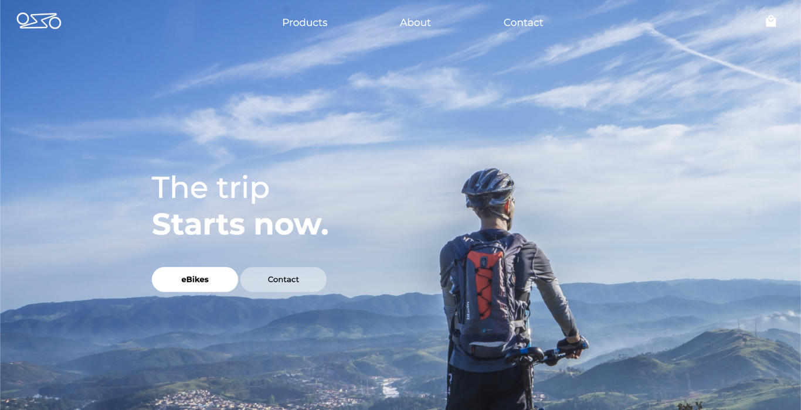

# E-bikes Ecommerce

This project basically is a prototype for an Ecommerce website selling E-bikes.
It is a full functional website with fully implemented front and back end and database.
I used a PERN stack (PostgreSQL, Express.js, React.js, Node.js).
His final goal is to consolidate my programming skills.

# Preview

Heres some screenshots from the website:

.png>)
.png>)
.png>)
.png>)
